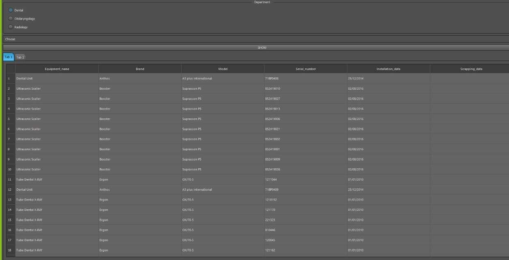
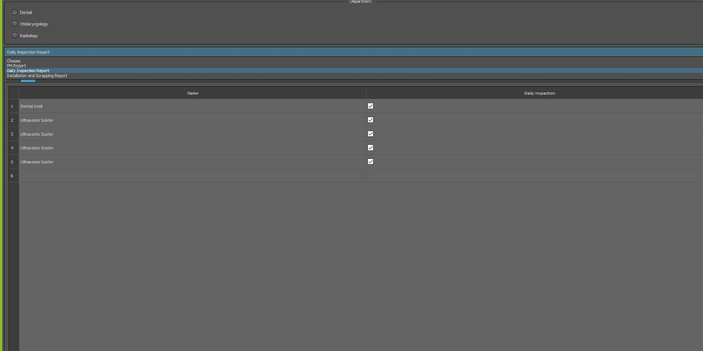
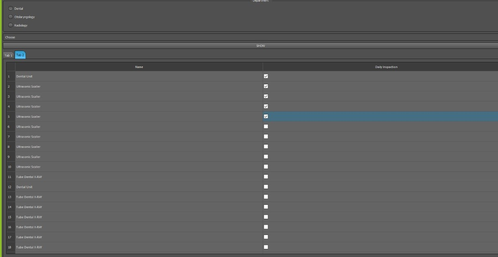
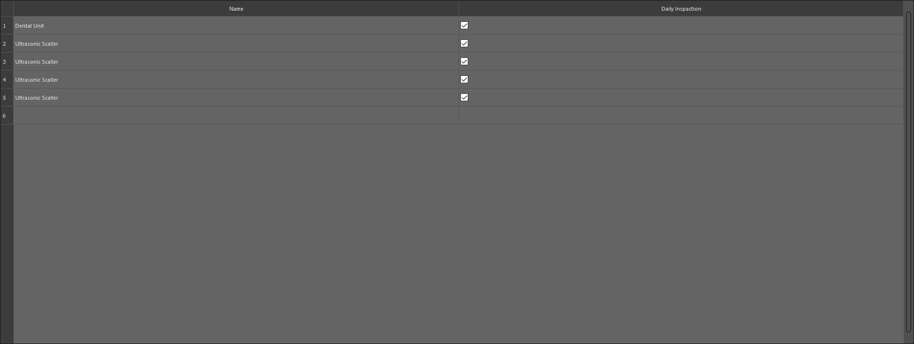
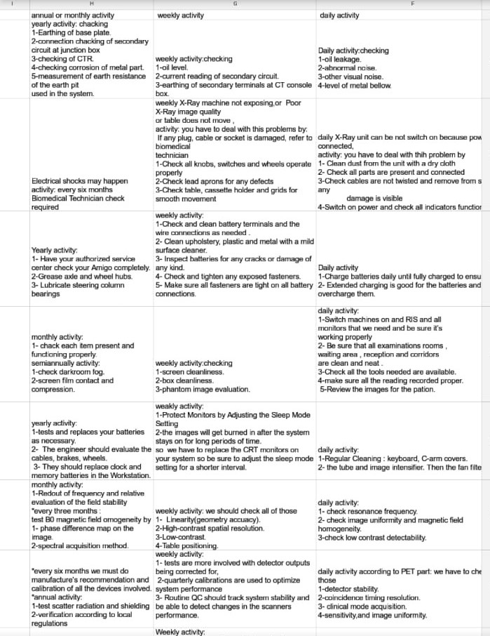

## CMMS Simulation 
### Team Members
##### **``Shaimaa gamal``**
##### **``Mariem Ahmed``**
##### **``Merna Mohamed``**
##### **``Neven Fathy``**
##### **``Enas Samir``**

# Steps
* ### **In the beginning,you must import data file in MySql with the same name and then run application**
* ### **after running code , you should choose any department you want to display its data**
* ### **press ``Show`` button for displaying data of selected department on tableWidget**

* ### **you can extract any report you want for this department from comboBox as shown in the following picture**

* ### **Data of daily inspaction is shown on tablWidget in tab 2**

* ### **when you require daily inspaction report from comboBox , all equipments that not selected will be deleted and our app take screenshot for remaining data**

* ### **PMM and Installation and Scrapping Reports will be appeaered in excel sheet that exported in the same path**

